# سير عمل المشروع الكامل

هذا الملف يصف **كيف يتحرك العمل** داخل نظام إدارة المهام من إنشاء الحساب حتى إغلاق المهمة، عبر الويب والـ API والموبايل.

القاعدة الثابتة: **مسؤول النظام يدير الحسابات والمساحات، مالك المساحة يدير الهيكل والفريق، مدير المشروع يدير التنفيذ، العضو ينفّذ مهامه.**

---

## 1. خريطة النظام الكلية

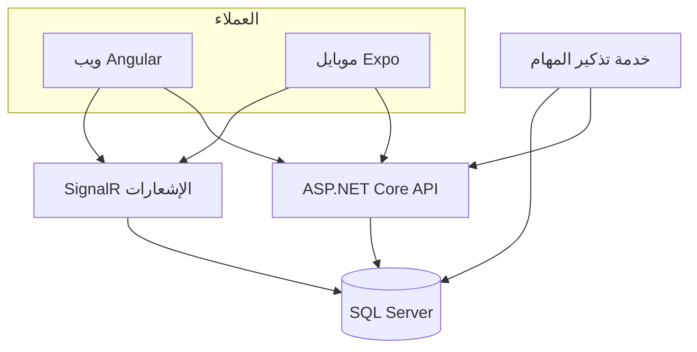

---

## 2. التسلسل الهرمي للبيانات

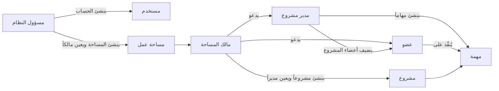

علاقة مهمة:

- المستخدم ينتمي للمساحة عبر `WorkspaceMember` (دور + حالة نشط).
- المشروع له مدير اختياري `ManagerUserId` وأعضاء عبر `ProjectMember`.
- المهمة تنتمي لمشروع واحد، وقد يكون لها معيَّنون وتعليقات ومرفقات واعتماديات.

---

## 3. المصادقة والجلسة

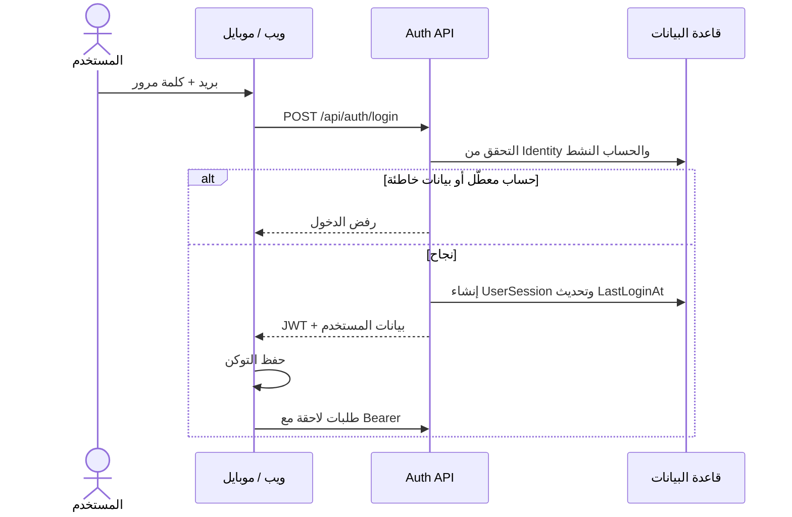

بعد الدخول:

1. يُحمَّل الملف الشخصي والمساحات.
2. تُحدَّد القوائم الظاهرة (مسؤول / مالك / مدير / عضو).
3. في الويب إن وُجد أكثر من دور يُختار **عرض النظام كـ** ويُحفظ محليًا.
4. الاتصال بـ `/hubs/notifications` لاستقبال الإشعارات فورًا.

عند **تعطيل الحساب** يزيد `TokenVersion` فتفشل التوكنات القديمة تلقائيًا.

---

## 4. استعادة كلمة المرور

لا يوجد بريد تلقائي يغيّر الكلمة مباشرة. المسار إداري:

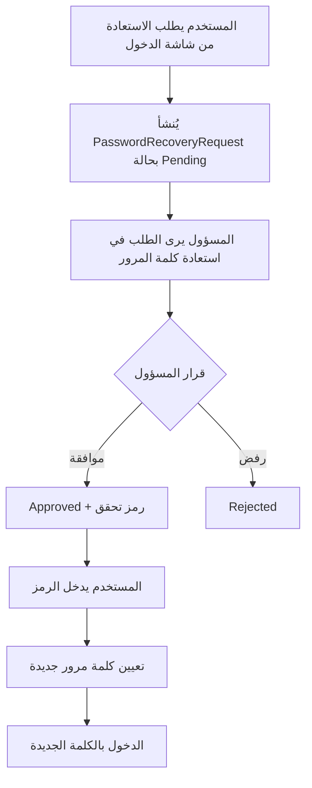

الطلب قد ينتهي أيضًا بحالة `Expired`.

---

## 5. سير عمل مسؤول النظام

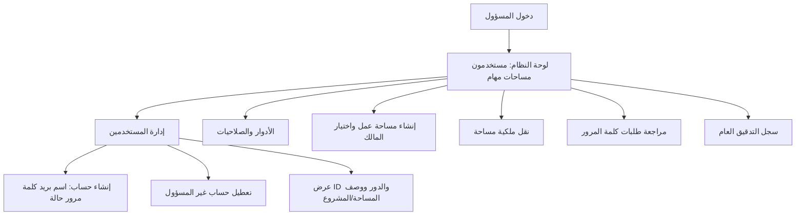

قواعد المسؤول:

- هو الوحيد الذي **ينشئ المساحات**.
- هو الوحيد الذي **ينقل الملكية**.
- لا يُضاف كمالك عبر الدعوة العادية.
- لا يُعطَّل حساب مسؤول النظام ولا حسابه الشخصي من الواجهة نفسها.

---

## 6. إنشاء مساحة العمل وربط المالك

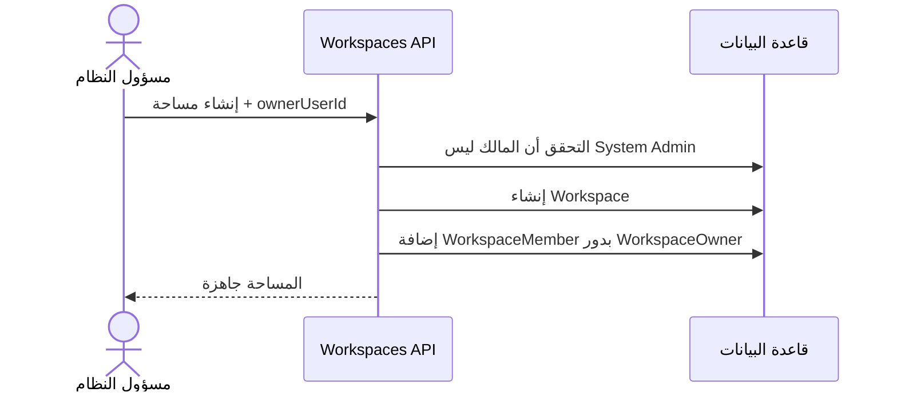

بعدها يظهر المالك في الويب/الموبايل داخل مساحته. المستخدم بلا مساحة يبقى في حالة انتظار دعوة.

---

## 7. الفريق والدعوات

### 7.1 من يُدعى؟

يُدعى فقط:

- مدير مشروع `ProjectManager`
- عضو `Member`

دور المالك لا يُمنح بالدعوة. لتغيير المالك يُستخدم **نقل الملكية** من المسؤول.

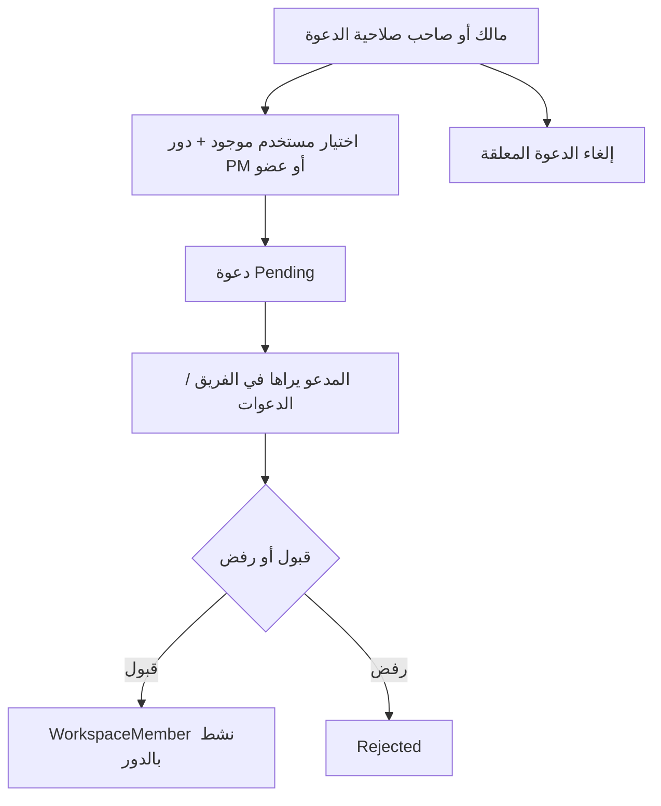

في صفحة الفريق (غير المسؤول): اسم المساحة ثابت بدون قائمة منسدلة، وقسم **أعضاء مساحة العمل** فوق **الدعوات المعلقة**.

يمكن لاحقًا تغيير دور العضو أو إزالته حسب الصلاحيات، مع منع نزع آخر مالك.

---

## 8. المشاريع وأعضاء المشروع

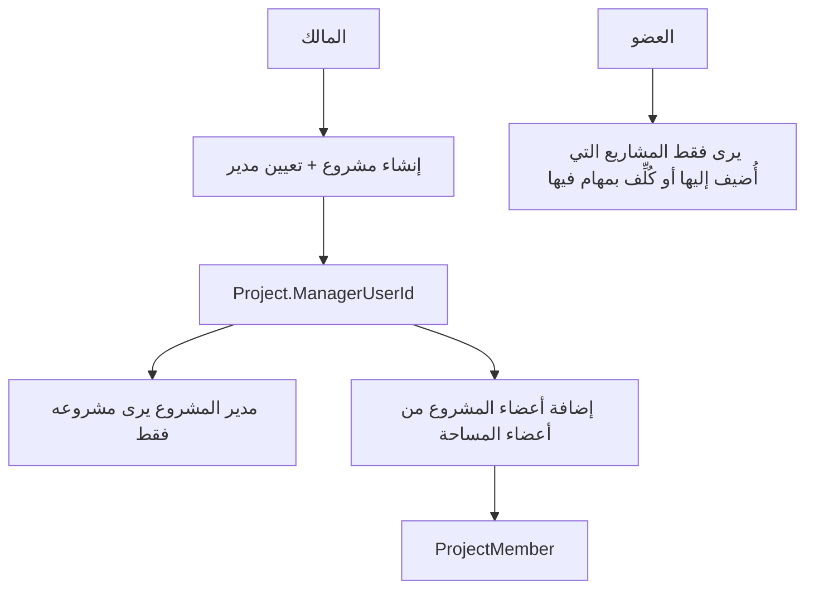

قواعد الرؤية:

- **المالك ومسؤول النظام:** كل مشاريع المساحة.
- **مدير المشروع:** المشاريع التي يديرها.
- **العضو:** المشاريع التي هو عضو فيها أو لديه مهام عليها.

المالك يتابع المشاريع من لوحة المعلومات وصفحة المشاريع **دون** إنشاء المهام داخلها.

---

## 9. سير عمل المهمة

### 9.1 من يستطيع ماذا؟

| العملية | مالك المساحة | مدير المشروع | عضو | مسؤول النظام |
|---------|--------------|--------------|-----|----------------|
| إنشاء / تعديل / حذف مهمة | ممنوع | نعم (مشروعه) | حسب الصلاحية والمشروع | تجاوز إداري |
| تغيير الحالة والتقدم | ممنوع | نعم | على مهامه عادة | نعم |
| التعيين | ممنوع | نعم | حسب `task.assign` | نعم |
| تعليق / مرفق | ممنوع | نعم | نعم ضمن مهمته/صلاحياته | نعم |
| الاعتماديات | ممنوع | نعم | حسب الصلاحية | نعم |

### 9.2 دورة حياة المهمة

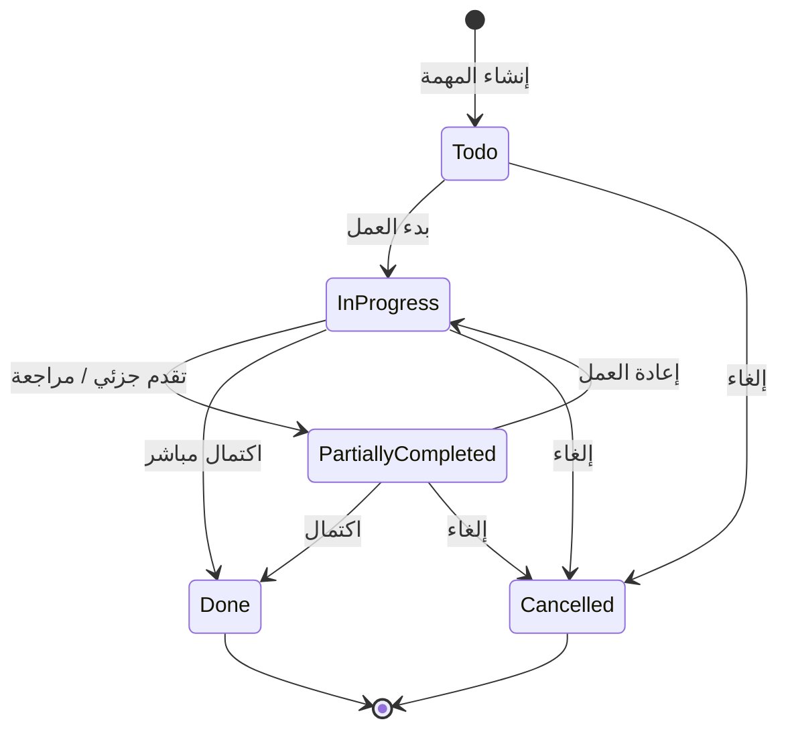

مع الحالة يُحدَّث اختياريًا:

- نسبة التقدم 0–100
- ملاحظة التقدم
- تاريخ التحديث

### 9.3 التعيين والتعليقات والمرفقات

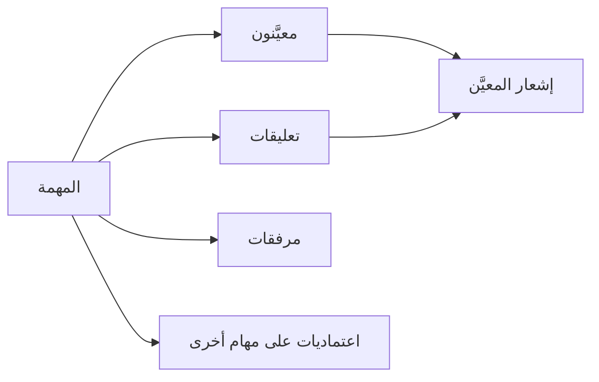

عند التعيين أو التعليق أو تغيير الحالة يُكتب `ActivityLog` ويُرسل `Notification` عبر قاعدة البيانات وSignalR.

### 9.4 الاعتماديات

- المهمة B قد تعتمد على A داخل المشروع نفسه.
- لا تُستخدم مهمة ملغاة كاعتمادية.
- لا تُحذف مهمة ما دامت أخرى تعتمد عليها حتى تُفك العلاقة.
- الواجهة تمنع إكمال عمل «معلّق» إذا كانت الاعتماديات غير مكتملة حسب قواعد الخدمة.

### 9.5 التذكير

خدمة الخلفية كل دقيقة تفحص الاستحقاق وتُنشئ تذكيرًا/إشعارًا للمعنيين إذا حان الوقت ولم تُغلق المهمة.

---

## 10. الإشعارات وسجل النشاط

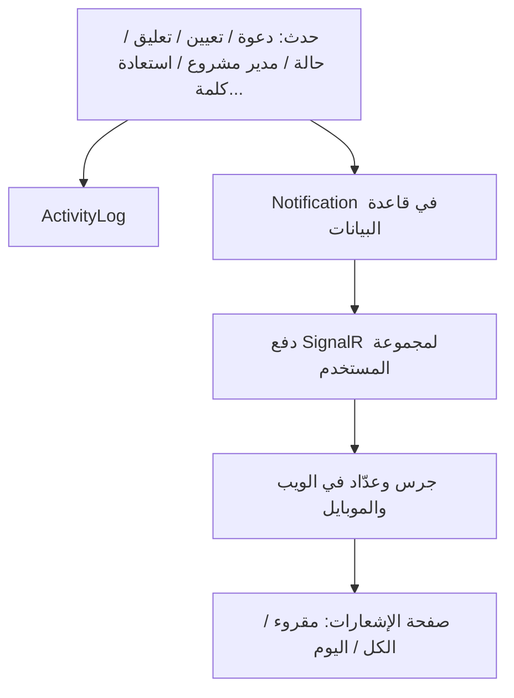

- المسؤول يرى **سجل التدقيق العام** لكل النظام مع فلاتر: بحث، رقم مستخدم، مصدر، تاريخ (بدون فلتر الإجراء المنفصل).
- غير المسؤول يرى نشاط مساحته (واسم المساحة ثابت إن كانت واحدة).
- العضو في لوحة المعلومات يرى نشاطه المرتبط به لا تدقيق المساحة كاملًا.

---

## 11. تجربة كل شخصية بعد الدخول (الويب)

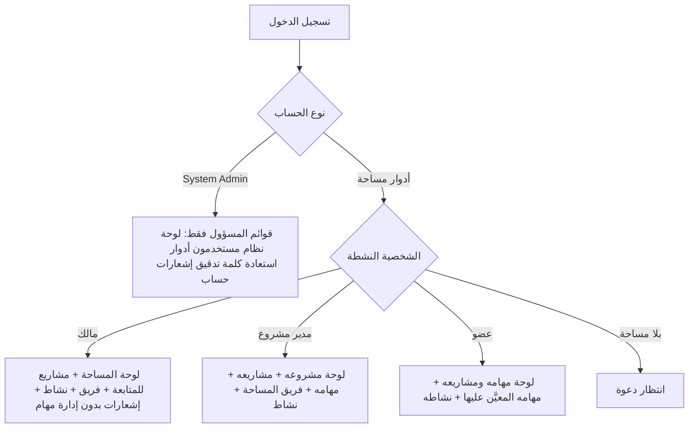

الموبايل يتبع القواعد نفسها عبر إظهار/إخفاء التبويبات والشاشات حسب الدور الفعلي، بدون مبدّل «عرض النظام كـ».

---

## 12. مسار يوم عمل نموذجي

1. المسؤول ينشئ حسابات `kasem` و`mustafa` و`nayef`.
2. المسؤول ينشئ مساحة «كلية الهندسة» ويجعل `kasem` مالكًا.
3. `kasem` يدعو `mustafa` كمدير مشروع و`nayef` كعضو.
4. المدعوون يقبلون الدعوة فيصبحون أعضاء نشطين.
5. `kasem` ينشئ مشروع «التخرج» ويعين `mustafa` مديرًا.
6. `mustafa` يضيف `nayef` إلى أعضاء المشروع.
7. `mustafa` ينشئ مهمة «جمع المتطلبات»، يعيّن `nayef`، ويربط اعتمادية إن لزم.
8. `nayef` يغيّر الحالة إلى قيد التنفيذ، يرفع مرفقًا، ويكتب تعليقًا.
9. يصل إشعار فوري لمدير المشروع، ويُسجَّل الحدث في النشاط.
10. عند الاستحقاق تصل تذكيرات إن بقيت المهمة مفتوحة.
11. بعد المراجعة تُغلق المهمة `Done`، وتظهر في رسوم لوحة المدير والمالك والعضو كلّ حسب نطاقه.

---

## 13. ملخص القواعد التي لا تُكسر

- لا إنشاء مساحة عمل إلا من مسؤول النظام.
- لا نقل ملكية إلا من مسؤول النظام.
- الدعوة فقط لمدير مشروع أو عضو.
- مالك المساحة لا يدير المهام التشغيلية.
- العضو لا يرى كل مشاريع المساحة؛ فقط ما انضم إليه.
- مدير المشروع يعمل داخل مشاريعه المعيَّن عليها كمدير.
- تعطيل المستخدم يلغي جلساته الحالية.
- الواجهات الثلاث (ويب، API، موبايل) تشترك في هذا السير؛ الاختلاف في شكل الشاشة لا في القاعدة.
